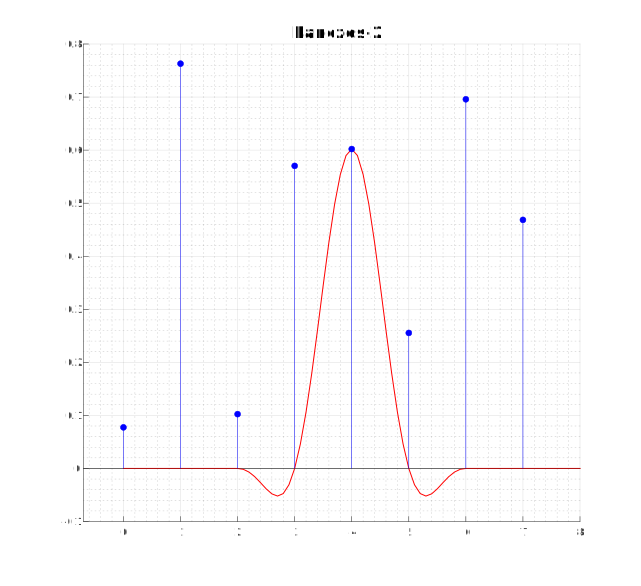
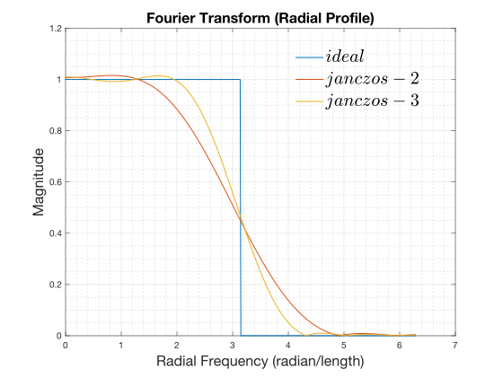
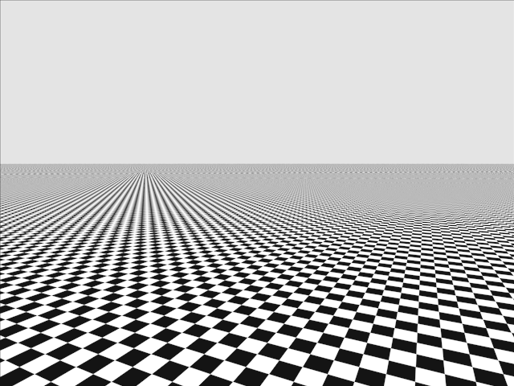

# Correct application of the Lanczos filter in 2D

<!-- TOC -->
* [Correct application of the Lanczos filter in 2D](#correct-application-of-the-lanczos-filter-in-2d)
  * [Introduction](#introduction)
    * [Temporal Anti-aliasing](#temporal-anti-aliasing)
    * [Temporal Anti-aliasing + Upscaling](#temporal-anti-aliasing--upscaling)
    * [Lanczos](#lanczos)
    * [Something isn't right](#something-isnt-right)
  * [2D Signal Processing](#2d-signal-processing)
    * [What is an image?](#what-is-an-image)
    * [The effect of sampling](#the-effect-of-sampling)
    * [2D image reconstruction](#2d-image-reconstruction)
    * [Just for fun...](#just-for-fun)
  * [Recap](#recap)
  * [Lanczos: take II](#lanczos-take-ii)
    * [Correct Radial Lanczos filter](#correct-radial-lanczos-filter)
  * [Conclusion](#conclusion)
* [Anti-aliasing](#anti-aliasing)
  * [Band-limiting / Nyquist-Shannon](#band-limiting--nyquist-shannon)
    * [What is anti-aliasing?](#what-is-anti-aliasing)
<!-- TOC -->

## Introduction

[Filament](https://github.com/google/filament) is an open-source 
Physically Based Renderer (PBR) targeting mobile platforms, 
[Android](https://www.android.com/) in particular. It features basic 
implementations of temporal anti-aliasing (TAA) and upscaling.

> [!NOTE]
> [A Survey of Temporal Antialiasing Techniques](http://behindthepixels.io/assets/files/TemporalAA.pdf) is an excelent starting point
> if you're not familiar with temporal antialiasing and upscaling.

### Temporal Anti-aliasing

Temporal Anti-Aliasing implementations need to sample both the input and
history buffers at arbitrary texture coordinates due to jittering and 
reprojection respectively. Bilinear sampling is inadequate because it results 
in an overly blurred image and exhibits anisotropic artifacts. 

[Filament](https://github.com/google/filament)’s TAA implementation uses a 
[2D CatMull-Rom](https://gist.github.com/TheRealMJP/c83b8c0f46b63f3a88a5986f4fa982b1) 
filter for sampling
the history buffer and a Blackman-Harris approximation for the input. These
filters were chosen without putting too much thought into it; CatMull-Rom is
a high quality and very efficient filter, while Blackman-Harris was suggested in
the “[High Quality Temporal Supersampling](https://advances.realtimerendering.com/s2014/#_HIGH-QUALITY_TEMPORAL_SUPERSAMPLING)” Siggraph 2014 presentation by
Brian Karis – so that was the end of it.

### Temporal Anti-aliasing + Upscaling

For temporal upscaling however, a filter that preserves more details is preferable.
Looking around the internet a bit, the [Lanczos](https://en.wikipedia.org/wiki/Lanczos_resampling) filter seemed to be a 
popular choice – it’s used by both [FSR](https://www.amd.com/en/products/graphics/technologies/fidelityfx/super-resolution.html) and [SGSR](https://www.qualcomm.com/news/onq/2023/04/introducing-snapdragon-game-super-resolution), so it seemed
natural to use it for sampling the input buffer. 

### Lanczos

Lanczos is a sinc-windowed
ideal reconstruction filter:

```math
L_a(x) = \left\{ \begin{array}{cl} sinc(x)sinc(x/a) & if \ |x| \lt a \\ 0 & otherwise \end{array} \right.
```


Lanczos as defined above is a 1D filter, but obviously here we need a 2D 
application of it. That's where things start to become weird. There is 
something peculiar in the various usages of Lanczos as a 2D filter;
Sometimes it is used as a radial basis function (RBF), and at other 
times it is used as a separable filter:

$$\begin{array}{cl}
L_2(x, y) & = L_2(\rho), & with\ \rho=\sqrt{x^2+y^2}\\
L_2(x, y) & = L_2(x)L_2(y) \end{array}$$

For example, FSR2 uses the separable application for sampling the history
buffer, but the RBF version for sampling the input buffer. Looking 
around the internet, the overwhelming explanation given is that Lanczos is not
separable, but for performance reasons it is often approximated by the 
separable version. This is for example the explanation given [here](https://github.com/jeffboody/Lanczos) – but 
there are many other sources that make the same claim. 

Oddly, the Lanczos [wikipedia](https://en.wikipedia.org/wiki/Lanczos_resampling) page unambiguously states that
$L_a(x, y) = L_a(x)L_a(y)$ without any justification – which seems at odds with
other popular parts of the internet.

The claim that $L_a(x, y)$ is defined as $L_a(\sqrt{x^2+y^2})$ and can be 
approximated by $L_a(x)L_a(y)$ is suspicious because no rigorous 
mathematical justification can be found **anywhere**.

### Something isn't right

I finally got around implementing Lanczos-2 into Filament using the RBF and 
supposed "correct" definition $L_2(x,y) = L_2(\sqrt{x^2+y^2})$ for sampling 
the TAA input. Surprisingly, it produced an overly sharpened image; sure,
it looked sharp, but it also looked wrong. 

Moreover, this sharpening happened even when centering the Lanczos kernel at
exactly pixel centers – You'd expect the filter to be a no-op in that case,
as it is in 1D.

\
_The 1D Lanczos filter is a no-op when centered on an input sample_

Obviously when looking at it more closely, it is clear that it cannot be a
no-op, since the corner samples are not located at the same distance as the 
“cross” samples, so they receive a negative weight:

\
_The "cross" samples all get a filter coefficient of exactly zero, while the
"corner" samples get a negative coefficient. The middle sample's coefficient
being exactly 1._

Clearly, something is isn't right. And when that happens, the best solution is 
to go back to first principles and stop trusting the internet.

## 2D Signal Processing

### What is an image?

More precisely, what is an image _generated by the GPU_? 

All the GPU does, really, is to **sample** triangles on a **regular grid**.
These samples are ultimately stored into memory, which, in our case is backing
a texture. The value of each sample is determined by running a fragment shader.

The key point to realize here is that the GPU has the same function as a 2D ADC 
(Analog-Digital Converter), sampling analytic geometry (triangles) at specific
locations on a regular grid.

The [Nyquist-Shannon Theorem](https://en.wikipedia.org/wiki/Nyquist%E2%80%93Shannon_sampling_theorem)
tells us that to perfectly reconstruct a 2D image, it must be sampled at 
at least twice the frequency as the highest horizontal and vertical frequencies 
present.

### The effect of sampling

> [!NOTE]
> Unless otherwise noted, all spatial-frequency graphs below have coordinate
> units in radian/pixel — divide by $2\pi$ for cycles/pixel.

After rendering, we're left with a sampled 2D image, whose samples are stored
in a texture, in a grid organized in rows and columns: a texture is **not** 
made of [small little squares](http://alvyray.com/Memos/CG/Microsoft/6_pixel.pdf).

Therefore, sampling can be seen as **multiplying** the original (analog/analytic)
image by a regular 2D dirac comb (also called bed-of-nails function). 
In the frequency domain this corresponds to the **convolution** of the image's 
spectrum by another bed-of-nails function. The convolution _splats_ a copy of 
the image's spectrum at each dirac pulse of the comb, effectively replicating 
the spectrum on a regular grid in the frequency domain, ad-infinitum:

\
_Sampling an Image (top-left) is equivalent to **multiplying** it by a 2D-comb
(middle-left) which results in the sampled image (bottom-left). In the spacial-frequency
domain, the image's spectrum (top-right) is **convolved** by the comb's spectrum
(middle-right) and results in a duplicated spectrum of the image (bottom-right)_

> [!NOTE]
> The images above are a simulation of sampling an analog image, in reality,
> and as stated above, the spectrum of the image is replicated in all directions
> forever (i.e: it's not limited to [-2,-2]).

The key idea to visualize here is that the spectrum is replicated on a 
**regular grid**.

### 2D image reconstruction

If we assume that Nyquist-Shannon is honored, we can reconstruct the original 
2D image without any loss just from its samples. This is done by removing the 
copies of the spectrum created by the sampling operation. Since the copies 
are placed on a regular grid, the _ideal reconstruction filter_ has
the shape of a square in the frequency domain:


This corresponds to a **convolution** by the separable, but anisotropic, 
filter $sinc(x,y) = sinc(x)sinc(y)$ in the spatial domain:


This filter is not isotropic, which can be problematic, especially when dealing
with rotations. The isotropic version of this ideal reconstruction filter has 
the shape of a disk in the frequency domain:


This corresponds to a **convolution** by the isotropic, RBF 
(non-separable) _jinc_ filter in the spatial domain:

$$\frac{\pi}{2} jinc\left(\sqrt{x^2+y^2}\right)$$

with $jinc(\rho)=J_1(\pi \rho) / \pi  r$


> [!NOTE]
> This is not the same as the _sinc_ filter:
> 
> 

> [!WARNING]
> The _sinc_ filter (as opposed to  _jinc_) yields to a wrong
> "reconstruction" filter that ends-up significantly sharpening the image's 
> high-frequencies:
>
> 

Because the disk has a smaller area as the square, this ideal, isotropic,
reconstruction filter will blur a little bit more than the square filter.
The disk reconstruction filter is ideal if the original signal is properly
band-limited (i.e. doesn't have spectral content outside of that disk).

> [!NOTE]
> Above we described the **ideal reconstruction filter**, in practice it
> cannot be implemented because it requires infinite support (i.e. infinite
> length). Instead, we use a windowed version of the ideal filter,
> such as Lanczos, or other low-pass filters.

### Just for fun...

It's not actually possible to reconstruct our original "square" image using
an _ideal reconstruction filter_ because that filter cannot be implemented
(here we have truncated version of it), and our original image wasn't 
band-limited in the first place:

\
_Reconstruction of an improperly band-limited image, using a truncated 
ideal sinc filter yields to anisotropic ringing artifacts_

## Recap

Just to recap, we’ve just shown that:
- separable _sinc_ is the ideal 2D reconstruction filter
- radial _jinc_ is the ideal isotropic reconstruction filter
- radial _sinc_ is just completely wrong

## Lanczos: take II

Given that we found the radial _sinc_ filter is an incorrect reconstruction 
filter, it's legitimate to ask: is the radial Lanczos filter also "incorrect"?

\
_Radial profiles of Lanczos-2 and -3 FFTs. High frequencies are heavily boosted._

And clearly *it is incorrect*. As can be seen above, the radial application of 
Lanczos, while isotropic, is a bad reconstruction filter which **overly
boosts** high-frequency while letting through a lot of the frequencies past the
ideal cut-off. This results in sharpening the image without preventing aliasing
artifacts effectively.

### Correct Radial Lanczos filter

Just like with _sinc_ and _jinc_ there is a correct version of the radial 
Lanczos filter, and unsurprisingly, it uses the _jinc_ function:

```math
L_a(\rho) = \left\{ \begin{array}{cl} \pi jinc(\rho)jinc(\rho/a) & if \ |\rho| \lt a \\ 0 & otherwise \end{array} \right.
```
with $jinc(\rho)=J_1(\pi \rho) / \pi  r$

\
_Radial profiles of jinc Lanczos-2 and -3 FFTs._

Unfortunately, this filter kernel is computationally intensive as it uses
the $J_1$ function, which makes it somewhat impractical to use, at least
without using a lookup table.

## Conclusion

The separable application of the Lanczos filter is actually correct — albeit 
not isotropic — and it is **not** an approximation of the radial application of
1D Lanczos unlike what can be often read on the internet. In that regard the
Lanczos wikipedia page is correct.

The correct radial and isotropic Lanczos application uses a modified Lanczos 
equation which uses _jinc_ instead of _sinc_.

# Anti-aliasing

## Band-limiting / Nyquist-Shannon

We've seen above that to be able to fully reconstruct the original 2D image
from its samples, the sampling operation needed to honor the Nyquist-Shannon 
Theorem. However, by default, rasterizing a triangle on the GPU does not. 
This often manifests with moiré patterns in areas of high frequencies.

\
_Aliasing can be seen in the distance. Low frequencies appear where there
should be none._

Two ways that GPUs can help us mitigate this during rasterization, is by 
using MSAA and mipmaping. MSAA addresses aliasing due to sampling the
geometry, while mipmapping addresses aliasing due to sampling textures. 

> [!NOTE]
> Shading computations can also create high frequencies, for example with
> specular highlights. 

MSAA and mipmapping effectively approximate sampling a band-limited image.

> [!NOTE]
> This explains why most spatial upscalers, such as FSR1 or SGSR1, work
> better with a "well anti-aliased" source image — a properly
> band-limited sampled image. Such an image can better be reconstructed 
> according to Nyquist-Shannon. In essence, the sampled image has more
> high-frequency information preserved (i.e.: it contains more of the 
> original image). 

### What is anti-aliasing?

Mathematically, anti-aliasing corresponds to sampling the signal (here an image)
at a higher rate and applying a low-pass filter to that (this is called
super-sampling anti-aliasing, or SSAA). Let's break it down:

When we sample the image at a higher rate, we effectively push higher the
frequencies destroyed by the overlap of the replicated spectra. In other words,
the frequencies that would have been destroyed at the lower sampling rate are
now intact (or at least not affected as much). Of course, our image is now of 
higher resolution, so we need to **re-sample** it; but this time, we first 
apply a digital low-pass filter, guaranteeing the Nyquist-Shannon prerequisite.

\
_16x Anti-aliasing using the separable Lanczos-3 low-pass filter. The moiré
pattern is reduced._

This is why "good" anti-aliasing is not "just the average" of the samples taken
within a pixel. Averaging corresponds to a box filter, which is a lousy
low-pass filter:

\
_Examples of various filters frequency response profiles. We use the radial
version of filters for illustration._

In many TAA implementations, the input samples are said to be "de-jittered" 
before accumulation — that's one way to think about it, but it hides a more
profound meaning; in reality we're applying a low-pass, band-limiting, filter
prior to re-sampling. This is the mathematical justification for SGSR and FSR's
(incorrect, keep reading) Lanczos-2, or Unreal's (correct) Blackman-Harris 
filters.
