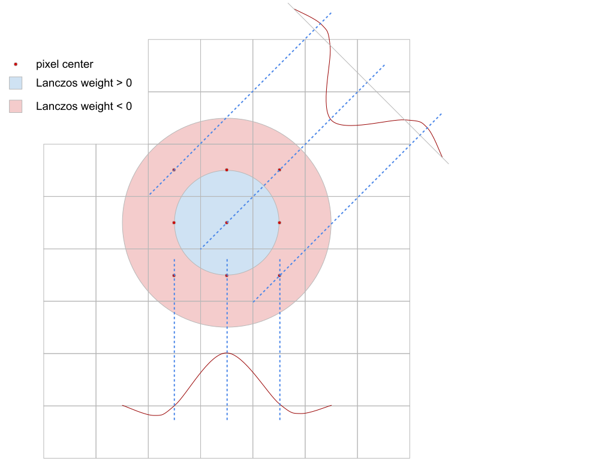
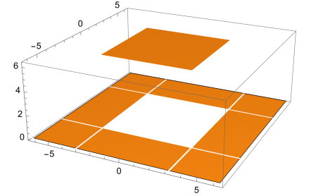

# Correct application of the Lanczos filter in 2D

<!-- TOC -->

* [Correct application of the Lanczos filter in 2D](#correct-application-of-the-lanczos-filter-in-2d)

<!-- TOC -->

Temporal Anti-Aliasing (TAA) implementations need to sample both the input and history buffers at arbitrary texture
coordinates. For this application, bilinear sampling is not adequate because it results in an overly blurred image. This
blurring effect is especially problematic for temporal upscaling which requires sampling the source image farther away
from the fragment.

[Filament](https://github.com/google/filament)’s TAA implementation uses a CatMull-Rom filter for sampling the history
buffer and Brian Karis’s Blackman-Harris approximation for the input. These filters were chosen without putting too much
thought into it; CatMull-Rom is high quality and very efficient, while Blackman-Harris was suggested in
the “[High Quality Temporal Supersampling](https://advances.realtimerendering.com/s2014/#_HIGH-QUALITY_TEMPORAL_SUPERSAMPLING)”
Siggraph 2014 presentation by Brian Karis – so that was the end of it.

Recently, I set out to add upscaling to Filament’s TAA and needed an input filter that would better preserve details.
Looking around a bit, the [Lanczos](https://en.wikipedia.org/wiki/Lanczos_resampling) filter seemed to be a popular
choice – it’s used by both [FSR](https://www.amd.com/en/products/graphics/technologies/fidelityfx/super-resolution.html)
and  [SGSR](https://www.qualcomm.com/news/onq/2023/04/introducing-snapdragon-game-super-resolution). I didn’t think
twice about it because it made sense to me, based on what I knew about the 1D Lanczos filter, which is a sinc-windowed
ideal reconstruction filter:

$L_a(x) = \left\{ \begin{array}{cl}
sinc(x)sinc(x/a) & if \ |x| \lt a \\
0 & otherwise
\end{array} \right.$

I noticed something peculiar in the various usages of Lanczos as a 2D filter; sometimes its 2D application is isotropic
and non separable, and at other times its 2D application is non-isotropic but separable:

$L_2(x, y) = L_2(r), with\ r=\sqrt{x^2+y^2}$

$L_2(x, y) = L_2(x)L_2(y)$

So… which is it? Looking around the internet, the overwhelming explanation given is that Lanczos is not separable, but
for performance reasons it is often approximated by the separable version. This is for example the explanation given
[here](https://github.com/jeffboody/Lanczos) – but there are many other sources that make the same claim. This felt like
a plausible explanation; and also, clearly Lanczos is not separable, so it sort of made sense.

My first mistake was to not question this claim though, I assumed the internet was right. However, I had noticed that
the Lanczos [wikipedia](https://en.wikipedia.org/wiki/Lanczos_resampling) page unambiguously states that 
$L(x, y) = L(x)L(y)$, but no justification is given; moreover I was starting to become suspicious about the 
approximation claim because nobody really studied what it actually did to the signal and there wasn’t any rigorous
mathematical justification to be found.

I finally got around implementing Lanczos-2 into Filament for sampling the TAA input. To my surprise, it produced an
overly sharpened image; sure, it looked sharp, but it also looked wrong. Moreover, this sharpening happened even when
centering the Lanczos kernel at exactly pixel centers – I was expecting the Lanczos filter to be a no-op in that case,
as it is in 1D.

Obviously when looking at it more closely, it is clear that it cannot be a no-op, since the corner samples are not
located at the same distance as the “cross” samples, so they receive a negative weight:

At that point, all my alarm bells are going off; something is definitely not right.

The only solution in these situations is to actually do the work and start from first principles – no more looking at
the internet for answers…

Q: What is an image?
A: It’s a collection of samples assumed to be on a regular grid (an image is not a collection of little square pixels!).

Q: What does it mean to sample an analog image?
A: Just like for the 1D case, it means the analog image signal is multiplied by a 2D dirac-impulse comb. In the
frequency domain this corresponds to the convolution of the image’s spectrum by a 2D dirac comb as well. In essence, the
original image spectrum is duplicated ad-infinitum on a regular grid. This is similar to the 1D case.

It results that the _ideal reconstruction filter_ has the shape of a square in the frequency domain and this corresponds
to a separable but not isotropic filter: $sinc(x,y) = sinc(x)sinc(y)$

This filter is not isotropic, which can be problematic, especially when dealing with rotations. The isotropic version of
this has the shape of a disk in the frequency domain which corresponds to the isotropic, non-separable _jinc_ filter:
$\pi^2 jinc\left(\sqrt{x^2+y^2}\right)$, with $jinc(r)=\frac{J_1(\pi  r)}{\pi  r}$

> [!CAUTION]
> This is not the same as the _sinc_ filter!

Because the disk has a smaller area as the square, this ideal, isotropic, reconstruction filter will blur a little bit
more than the square filter. The disk reconstruction filter is ideal if the original, analog, signal is properly
band-limited (i.e. low-pass filtered by at least the same disk).

How interesting. Just to recap, we’ve just shown that the ideal 2D reconstruction filter is the separable, non-isotropic
sinc filter. A slightly less ideal reconstruction filter is the non-separable, isotropic jinc (not sinc) filter.

