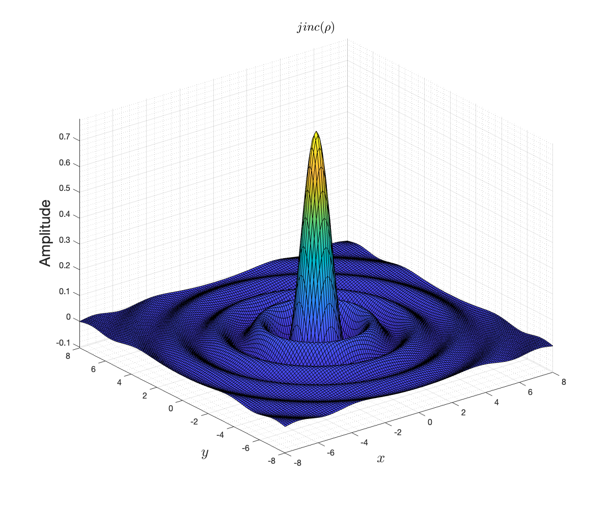
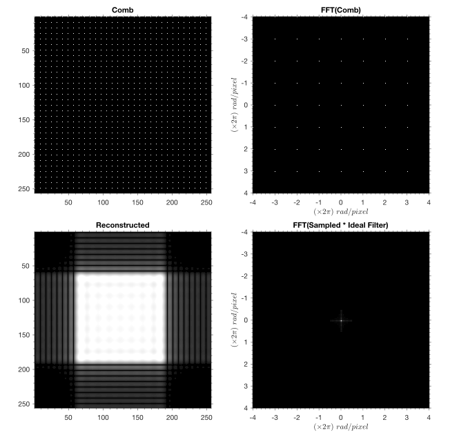
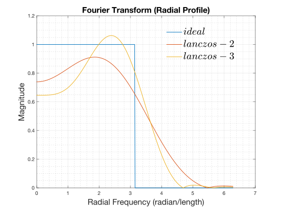
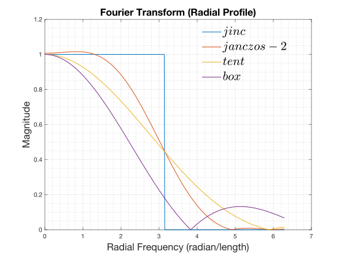
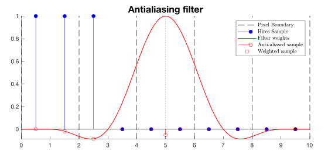

<!-- TOC -->
* [Introduction](#introduction)
* [Correct 2D Lanczos filter application](#correct-2d-lanczos-filter-application)
  * [Preamble](#preamble)
    * [Temporal Anti-aliasing](#temporal-anti-aliasing)
    * [Temporal Anti-aliasing + Upscaling](#temporal-anti-aliasing--upscaling)
    * [Lanczos](#lanczos)
    * [Something isn't right](#something-isnt-right)
  * [2D Signal Processing](#2d-signal-processing)
    * [What is an image?](#what-is-an-image)
    * [The effect of sampling](#the-effect-of-sampling)
    * [2D image reconstruction](#2d-image-reconstruction)
    * [Just for fun...](#just-for-fun)
  * [Recap](#recap)
  * [Lanczos: take II](#lanczos-take-ii)
    * [Correct Radial Lanczos filter](#correct-radial-lanczos-filter)
  * [Conclusion](#conclusion)
* [Anti-aliasing](#anti-aliasing)
  * [Band-limiting / Nyquist-Shannon](#band-limiting--nyquist-shannon)
  * [What is anti-aliasing?](#what-is-anti-aliasing)
  * [Spatial anti-aliasing filter](#spatial-anti-aliasing-filter)
* [Temporal Anti-aliasing](#temporal-anti-aliasing-1)
  * [Temporal anti-aliasing filter](#temporal-anti-aliasing-filter)
    * [Averaging & Normalization weights](#averaging--normalization-weights)
    * [Caveat](#caveat)
      * [Filter Kernel with negative lobes](#filter-kernel-with-negative-lobes)
  * [Temporal Upscaling & Anti-aliasing filter](#temporal-upscaling--anti-aliasing-filter)
    * [Caveats](#caveats)
      * [Normalization weights](#normalization-weights)
      * [Deringing](#deringing)
* [Conclusions](#conclusions)
  * [2D lanczos applications](#2d-lanczos-applications)
  * [TAA history accumulation feedback parameter](#taa-history-accumulation-feedback-parameter)
  * [TAA upscaling filter support](#taa-upscaling-filter-support)
<!-- TOC -->

# Introduction

[Filament](https://github.com/google/filament) is an open-source
Physically Based Renderer (PBR) targeting mobile platforms,
[Android](https://www.android.com/) in particular. It features basic
implementations of temporal anti-aliasing (TAA) and upscaling.

Below we discuss a few implementation details of temporal anti-aliasing and
upscaling:
- The correct 2D application of the Lanczos filter.
- The shape, size and position of the anti-aliasing filter.
- The history feedback parameter.

> [!NOTE]
> [A Survey of Temporal Antialiasing Techniques](http://behindthepixels.io/assets/files/TemporalAA.pdf)
> is an excellent starting point if you're not familiar with temporal antialiasing and upscaling.

# Correct 2D Lanczos filter application

## Preamble

### Temporal Anti-aliasing

Temporal anti-aliasing implementations need to sample both the input and
history buffers at arbitrary texture coordinates due to jittering and 
reprojection respectively. Bilinear sampling is inadequate because it results 
in an overly blurred image and exhibits anisotropic artifacts. 

[Filament](https://github.com/google/filament)’s TAA implementation uses a 
[2D CatMull-Rom](https://gist.github.com/TheRealMJP/c83b8c0f46b63f3a88a5986f4fa982b1) 
filter for sampling
the history buffer and a Blackman-Harris approximation for the input. These
filters were chosen without putting too much thought into it. CatMull-Rom is
a high quality and very efficient filter, while Blackman-Harris was suggested in
the “[High Quality Temporal Supersampling](https://advances.realtimerendering.com/s2014/#_HIGH-QUALITY_TEMPORAL_SUPERSAMPLING)” Siggraph 2014 presentation by
Brian Karis – so that was the end of it.

### Temporal Anti-aliasing + Upscaling

For temporal upscaling however, a filter that preserves more details is preferable.
Looking around the internet a bit, the [Lanczos](https://en.wikipedia.org/wiki/Lanczos_resampling) filter seemed to be a 
popular choice – it’s used by both [FSR](https://www.amd.com/en/products/graphics/technologies/fidelityfx/super-resolution.html)
and [SGSR](https://www.qualcomm.com/news/onq/2023/04/introducing-snapdragon-game-super-resolution),
so it seemed natural to use it for sampling the input buffer. 

### Lanczos

Lanczos is a sinc-windowed ideal reconstruction filter:

```math
L_a(x) = \left\{ \begin{array}{cl} sinc(x)sinc(x/a) & if \ |x| \lt a \\ 0 & otherwise \end{array} \right.
```


Lanczos can be used effectively for resampling a digital signal or as a 
low-pass filter.

The $a$ parameter defines the filter support or width. The larger
the support the better the filter performs (i.e.: approximates the ideal
reconstruction filter), but the more computationally intensive it becomes. 
Lanczos-2, or $L_2(x)$, has a width of 4 and requires four samples when used
to resample a signal. Similarly, Lanczos-3, or $L_3(x)$, has a width of 6 and
requires six samples.

Lanczos as defined above is a 1D filter, but obviously here we need a 2D 
application of it. That's where things start to become weird. There is 
something peculiar in the various usages of Lanczos as a 2D filter: sometimes it
is used as a radial basis function (RBF), and at other times it is used as a 
separable filter:

$$\begin{array}{cl}
L_2(x, y) & = L_2(\rho), & with\ \rho=\sqrt{x^2+y^2}\\
L_2(x, y) & = L_2(x)L_2(y) \end{array}$$

For example, FSR2 uses the separable application for sampling the history
buffer, but the RBF version for sampling the input buffer. Looking 
around the internet, the overwhelming explanation given is that Lanczos is not
separable, but for performance reasons it is often approximated by the 
separable version. This is for example the explanation given
[here](https://github.com/jeffboody/Lanczos), but there are many other sources
that make the same claim. 

Oddly, the Lanczos [Wikipedia](https://en.wikipedia.org/wiki/Lanczos_resampling) page
unambiguously states that $L_a(x, y) = L_a(x)L_a(y)$ without any justification, which
seems at odds with other popular sources.

The claim that $L_a(x, y)$ is defined as $L_a(\sqrt{x^2+y^2})$ and can be 
approximated by $L_a(x)L_a(y)$ is suspicious because no rigorous 
mathematical justification can be found **anywhere**.

### Something isn't right

I finally got around implementing Lanczos-2 into Filament using the RBF and 
supposed "correct" definition $L_2(x,y) = L_2(\sqrt{x^2+y^2})$ for sampling 
the TAA input. Surprisingly, it produced an overly sharpened image. It looked
sharp, but it also looked wrong. 

Moreover, this sharpening happened even when centering the Lanczos kernel
exactly at pixel centers. We would expect the filter to be a no-op in that
case, as it is in 1D.

\
_The 1D Lanczos filter is a no-op when centered on an input sample_

When looking at it more closely, it is clear that it cannot be a no-op,
since the corner samples are not located at the same distance as the 
“cross” samples, so they receive a negative weight:

\
_The "cross" samples all get a filter coefficient of exactly zero, while the
"corner" samples get a negative coefficient. The middle sample's coefficient
being exactly 1._

Clearly, something isn't right. And when that happens, the best solution is 
to go back to first principles and stop trusting the Internet.

## 2D Signal Processing

### What is an image?

More precisely, what is an image _generated by the GPU_? 

All the GPU does, really, is to **sample** triangles on a **regular grid**.
These samples are ultimately stored into memory, which, in our case, is a texture.
The value of each sample is determined by running a fragment shader.

The key point to realize here is that the GPU has the same function as a 2D ADC 
(Analog-Digital Converter), sampling analytic geometry (triangles) at specific
locations on a regular grid.

The [Nyquist-Shannon Theorem](https://en.wikipedia.org/wiki/Nyquist%E2%80%93Shannon_sampling_theorem)
tells us that to perfectly reconstruct a 2D image, it must be sampled at 
at least twice the frequency as the highest horizontal and vertical frequencies 
present.

### The effect of sampling

> [!NOTE]
> Unless otherwise noted, all spatial-frequency graphs below have coordinate
> units in radian/pixel — divide by $2\pi$ for cycles/pixel.

After rendering, we're left with a sampled 2D image, whose samples are stored
in a texture, in a grid organized in rows and columns: a texture is **not** 
made of [small little squares](http://alvyray.com/Memos/CG/Microsoft/6_pixel.pdf).

Therefore, sampling can be seen as **multiplying** the original (analog/analytic)
image by a regular 2D dirac comb (also called bed-of-nails function). 
In the frequency domain this corresponds to the **convolution** of the image's 
spectrum by another bed-of-nails function. The convolution _splats_ a copy of 
the image's spectrum at each dirac pulse of the comb, effectively replicating 
the spectrum on a regular grid in the frequency domain, ad-infinitum:

\
_Sampling an Image (top-left) is equivalent to **multiplying** it by a 2D-comb
(middle-left) which results in the sampled image (bottom-left). In the spacial-frequency
domain, the image's spectrum (top-right) is **convolved** by the comb's spectrum
(middle-right) and results in a duplicated spectrum of the image (bottom-right)_

> [!NOTE]
> The images above are a simulation of sampling an analog image. In reality,
> and as stated above, the spectrum of the image is replicated in all directions
> forever (i.e: it's not limited to $[-4, 4]$).

The key idea to visualize here is that the spectrum is replicated on a 
**regular grid**.

### 2D image reconstruction

If we assume that Nyquist-Shannon is satisfied, we can reconstruct the original 
2D image without any loss just from its samples. This is done by removing the 
copies of the spectrum created by the sampling operation. Since the copies 
are placed on a regular grid, the _ideal reconstruction filter_ has
the shape of a square in the frequency domain:


This corresponds to a **convolution** by the separable, but anisotropic, 
filter $sinc(x,y) = sinc(x)sinc(y)$ in the spatial domain:


This filter is not isotropic, which can be problematic, especially when dealing
with rotations. The isotropic version of this ideal reconstruction filter has 
the shape of a disk in the frequency domain:


This corresponds to a **convolution** by the isotropic, RBF 
(non-separable) _jinc_ filter in the spatial domain:

$$\frac{\pi}{2} jinc\left(\sqrt{x^2+y^2}\right)$$

with $jinc(\rho)=J_1(\pi \rho) / \pi \rho$\
and $J_1$ a [Bessel Function of the First Kind](https://en.wikipedia.org/wiki/Bessel_function#Spherical_Bessel_functions): 
$J_1(x) = \frac{1}{\pi}\int_0^\pi{cos(n\tau-x sin \tau)d\tau}$



> [!NOTE]
> This is not the same as the _sinc_ filter:
> 
> 

> [!IMPORTANT]
> The _sinc_ filter (as opposed to  _jinc_) yields to a wrong
> "reconstruction" filter that ends up significantly sharpening the image's
> high-frequencies:
>
> 

Because the disk has a smaller area than the square, this ideal, isotropic,
reconstruction filter will blur a little bit more than the square filter.
The disk reconstruction filter is ideal if the original signal is properly
band-limited (i.e. doesn't have spectral content outside of that disk).

> [!NOTE]
> We just described the **ideal reconstruction filter**. It cannot be
> implemented in practice because it requires infinite support (i.e. infinite
> length). Instead, we use a windowed version of the ideal filter, 
> such as Lanczos, or other low-pass filters.

### Just for fun...

It's not actually possible to reconstruct our original "square" image using
an _ideal reconstruction filter_ because that filter cannot be implemented
(here we have a truncated version of it), and our original image wasn't
band-limited in the first place:

\
_Reconstruction of an improperly band-limited image, using a truncated 
ideal sinc filter, yields to anisotropic ringing artifacts._

## Recap

Just to recap, we’ve just shown that:
- Separable $sinc(x, y)$ is the ideal 2D reconstruction filter.
- Radial $jinc(\rho)$ is the ideal isotropic reconstruction filter.
- Radial $sinc(\rho)$ is just completely wrong.

## Lanczos: take II

Given that we found the radial $sinc$ filter is an incorrect reconstruction 
filter, it's legitimate to ask whether the radial Lanczos filter is also "incorrect"?

\
_Radial profiles of Lanczos-2 and -3 FFTs. High frequencies are heavily boosted._

And clearly *it is incorrect*. As can be seen above, the radial application of 
Lanczos, while isotropic, is a bad reconstruction filter which **overly
boosts** high-frequency while letting through a lot of the frequencies past the
ideal cut-off. This results in sharpening the image without preventing aliasing
artifacts effectively.

### Correct Radial Lanczos filter

Just like with $sinc$ and $jinc$, there is a correct version of the radial 
Lanczos filter which, unsurprisingly, uses the $jinc$ function:

```math
L_a(\rho) = \left\{ \begin{array}{cl} \pi jinc(\rho)jinc(\rho/a) & if \ |\rho| \lt a \\ 0 & otherwise \end{array} \right.
```
with $jinc(\rho)=J_1(\pi \rho) / \pi \rho$

\
_Radial profiles of_ $jinc$ _Lanczos-2 and -3 FFTs._

Unfortunately, this filter kernel is computationally intensive as it uses
the $J_1$ function, which makes it somewhat impractical to use, at least
without using a lookup table.
 
## Conclusion

The separable application of the Lanczos filter is actually correct — albeit 
not isotropic — and it is **not** an approximation of the radial application of
1D Lanczos unlike what can be often read on the Internet. In that regard, the
Lanczos Wikipedia page is correct.

The correct radial and isotropic Lanczos application uses a modified Lanczos 
equation which uses $jinc$ instead of $sinc$.
 
The radial application of the 1D Lanczos filter, $L_a(\rho)$, is incorrect.

# Anti-aliasing

## Band-limiting / Nyquist-Shannon

We've seen above that to be able to fully reconstruct the original 2D image
from its samples, the sampling operation needed to satisfy the Nyquist-Shannon 
theorem. Failing to do so causes the part of the spectrum above the Nyquist
frequency to _fold back_ onto the part of the spectrum below it, effectively 
_destroying_ that part of the signal. This folding is due to the [infinite
replication](#the-effect-of-sampling) of the spectrum at every multiple of the 
Nyquist frequency.

Below is an illustration of this effect in 1-D. This shows the spectrum over
time of a frequency sweep between 0 and 6KHz, for a sampling rate of 10KHz.
The Nyquist frequency is therefore 5KHz, and the part of the spectrum between
5KHz and 6KHz is _folded back_ around 5KHz, destroying the signal between 4KHz
and 5KHz.


By default, rasterizing a triangle on the GPU does not satisfy the 
Nyquist-Shannon constraint, and this often manifests with moiré patterns in areas 
of high frequencies, which become **unrecoverable**.

\
_Aliasing can be seen in the distance. Low frequencies appear where there 
should be none._

MSAA and mipmaping are two ways that GPUs can use to help mitigate this during
rasterization. MSAA addresses aliasing due to sampling the geometry,
while mipmapping addresses aliasing due to sampling textures. 

> [!NOTE]
> Shading computations can also create high frequencies, for example with
> specular highlights. 

MSAA and mipmapping effectively approximate sampling a band-limited image.

> [!NOTE]
> This explains why most spatial upscalers, such as FSR1 or SGSR1, work
> better with a "well anti-aliased" source image, a properly
> band-limited sampled image. Such an image can be better reconstructed
> according to Nyquist-Shannon. In essence, the sampled image has more
> high-frequency information preserved (i.e.: it contains more of the 
> original image). 

## What is anti-aliasing?

Mathematically, anti-aliasing corresponds to sampling the signal (here an image)
at a higher rate and applying a low-pass filter to that (this is called 
super-sampling anti-aliasing, or SSAA).

When we sample the image at a higher rate, we effectively push higher the
frequencies destroyed by the overlap of the replicated spectra. In other words,
the frequencies that would have been destroyed at the lower sampling rate are
now intact (or at least not affected as much). Of course, our image is now of 
higher resolution, so we need to **re-sample** it. This time however, we first 
apply a digital low-pass filter, satisfying Nyquist-Shannon.

\
_256x Anti-aliasing using the separable Lanczos-2 low-pass filter. The moiré
pattern is reduced._

This is why "good" anti-aliasing is not "just the average" of the samples taken
within a pixel. Averaging corresponds to a box filter, which is a lousy
low-pass filter:

\
_Examples of various filters frequency response profiles. We use the radial
version of filters for illustration._

## Spatial anti-aliasing filter

We render the image at a higher
resolution than the desired output resolution, for instance 4x. The higher
sampling rate allows higher frequencies in the image to be preserved by
the sampling process, instead of being _folded back_ into the image due to
the spectrum replication discussed earlier.

The output image is then reconstructed by applying a low-pass filter satisfying
the Nyquist frequency at the output resolution. Output, anti-aliased,
samples are reconstructed one at a time by applying the low-pass filter,
for example Lanczos-2. This precisely corresponds to the figure below:


The anti-aliased sample is reconstructed by calculating the weighted-sum of
each high-resolution sample by the kernel value at that sample location. This
is called a **convolution**:

$$\bar{s}[j] = \frac{1}{K} \sum_{i=-N}^{N}s[j-i]w_i$$

Importantly, the result needs to be normalized by the sum of the kernel weights:

$$K = \sum_{i=-N}^{N}w_i$$

Notice that the kernel is centered on the sample to be reconstructed, and the
width of its first lobe is two low-resolution (anti-aliased) pixels. **This
exactly matches the corresponding reconstruction filter for the target
resolution image.**

# Temporal Anti-aliasing

Temporal anti-aliasing aims to spread the filter computation over multiple
frames to reduce the computation demands.

Each frame $i$ is calculating a _partial_ result per pixel $j$, $`\bar{s}_i[j]`$, 
which gets accumulated to the target pixel, $`h_{i-1}[j]`$, converging to the 
**average** over time:

$$h_i = (1 - \alpha) \cdot h_{i-1} + \alpha \cdot \bar{s}_i$$

## Temporal anti-aliasing filter

> [!NOTE]
> We can do all the analysis in one dimension because we've seen earlier 
> that we can use separable reconstruction filters, which consists of 
> 1-D filters applied horizontally first and then vertically.

Each frame is rendered at the _same_ resolution — or sampling rate — as
the target image, but is offset in order to take a different sample. A partial 
low-pass filter is applied and the result is accumulated to the output image,
as per the equation above.


Here we get a subset of the samples each frame, specifically one per
output pixel, but we apply exactly the same filter as in the spacial case: 
it has the same center and size as before. 

> [!NOTE]
> This is what is often called "unjittering" in many TAA implementations 
> (because the kernel is offset by the jitter-offset to keep it centered on the
> target pixel-center). "Unjittering" is a bit of a misnomer, as all we're doing
> is keeping the **kernel** centered on the target pixel.

As seen previously, each frame is calculating a _partial_ result, $`\bar{s}_i`$,
which gets accumulated to the target frame, $`h_{i-1}`$ typically as follows:

$$h_i = (1 - \alpha) \cdot h_{i-1} + \alpha \cdot \bar{s}_i$$

This operation converges to the average of $\bar{s}_i$ over time:

$$h_i = \alpha \sum_{k=0}^{\infty}(1-\alpha)^k \bar{s}_{i-k}$$

Because $`\bar{s}_i`$ is periodic (i.e.: $`\bar{s}_i = \bar{s}_{i-n}`$), 
we can show that:

$$h_i = \alpha \sum_{k=0}^{\infty}{(1-\alpha)^{k \cdot n}} \sum_{k=0}^{n-1}(1-\alpha)^k \bar{s}_{i-k}$$

$$h_i = \frac{\alpha}{1 - (1 - \alpha)^n} \sum_{k=0}^{n-1}(1-\alpha)^k \bar{s}_{i-k}$$

And finally, when $\alpha \rightarrow 0$, this expression becomes:

$$\boxed{ h_i = \frac{1}{n} \sum_{k=0}^{n-1}\bar{s}_k }$$

which is the **average** of $\bar{s}_i$.

> [!NOTE]
> At the $\alpha \rightarrow 0$ limit, $h_i$ doesn't depend on $i$.

So in the end, the partial filter results are essentially _averaged_, provided 
that $\alpha$ is small.

### Averaging & Normalization weights

The averaging over $n$ frames of the partial filter outputs produces an 
incorrect result because the convolution normalization factor is applied to 
the partial result at each frame, i.e.:

$$\bar{s}[j] \ne \frac{1}{n} \left( \bar{s}_ 0[j] + \cdots + \bar{s}_ {n-1}[j] \right)$$

It is however possible to fix this problem by multiplying the accumulation 
factor $\alpha$ by $K_i$, the sum of the weights of each partial filter 
(with $r_i$ the unnormalized partial filter output):

$$h_i = (1 - \alpha \cdot K_i) \cdot h_{i-1} + \alpha \cdot r_i$$

>[!NOTE]
> As a nice side effect, this also removes the possible divide-by-0 when 
> $K_i$ is null.

The steady-state sequence $`\bar{h}_i`$ must satisfy the defining equation:

$$\bar{h}_ i = (1-\alpha \cdot K_ i) \cdot \bar{h}_ {i-1} + \alpha \cdot \bar{r}_ i$$

and because it's periodic of period $n$, we know that 
$`\bar{h}_i = \bar{h}_{i+n}`$. We can sum both sides of the steady-state equation 
over one period:

$$\sum_{i=1}^{n}\bar{h}_ i = \sum_{i=1}^{n}(1-\alpha \cdot K_ i) \cdot \bar{h}_ {i-1} + \sum_{i=1}^{n}\alpha \cdot \bar{r}_ i$$

$$\sum_{i=1}^{N}\bar{h}_ i = \sum_{i=1}^{n} (\bar{h}_ {i-1} - \alpha \cdot K_i \cdot \bar{h}_ {i-1}) + \sum_{i=1}^{n}\alpha \cdot \bar{r}_ i$$

$$
\begin{equation}
\sum_{i=1}^{N}\bar{h}_ i = \sum_{i=1}^{n} \bar{h}_ {i-1} - \sum_{i=1}^{n} \alpha \cdot K_ i \cdot \bar{h}_ {i-1} + \sum_{i=1}^{n}\alpha \cdot \bar{r}_ i \ \ \ \ \ \text(1)
\end{equation}
$$

Now, let's compare $`\sum_{i=1}^{N}\bar{h}_i`$ and $`\sum_{i=1}^{N}\bar{h}_{i-1}`$ 

$$\sum_{i=1}^{n}\bar{h}_ i     = \bar{h}_ 1 + \bar{h}_ 2 + \cdots + \bar{h}_ {n-1} + \bar{h}_ n$$
$$\sum_{i=1}^{n}\bar{h}_ {i-1} = \bar{h}_ 0 + \bar{h}_ 1 + \cdots + \bar{h}_ {n-2} + \bar{h}_ {n-1}$$

Because $`\bar{h}_0 = \bar{h}_n`$ both expressions are identical. Therefore:

$$\sum_{i=1}^{N}\bar{h}_ i = \sum_{i=1}^{N}\bar{h}_ {i-1}$$

We can now substitute this equality in equation $`(1)`$

$$\sum_{i=1}^{N}\bar{h}_ {i-1} = \sum_{i=1}^{n} \bar{h}_ {i-1} - \sum_{i=1}^{n} \alpha \cdot K_ i \cdot \bar{h}_ {i-1} + \sum_{i=1}^{n}\alpha \cdot \bar{r}_ i$$

Rearrange and divide by $\alpha$:

$$\sum_{i=1}^n K_ i \cdot \bar{h}_ {i-1} = \sum_{i=1}^{n} \bar{r}_ i$$

Now, take the limit as $`\alpha \rightarrow 0`$. In this limit, the steady state 
$`\bar{h}_i`$ approaches a constant for all $i$. So, $`\bar{h}_{i-1}`$ also 
approaches this constant. Substituting this into the summed equation:

$$lim_{\alpha \to 0} \sum_{i=1}^{n} K_ i \cdot \bar{h}_ {i-1} = lim_{\alpha \to 0} \sum_{i=1}^{n} \bar{r}_ i$$

because neither $`K_i`$ nor $`r_i`$ depend on $`\alpha`$:

$$\sum_{i=1}^{n} K_ i \cdot lim_{\alpha \to 0} \bar{h}_ {i-1} =  \sum_{i=1}^{n} \bar{r}_ i$$

And since $`lim_{\alpha \to 0} \bar{h}_{i-1}`$ is a constant by definition 
(it's the value the series is converging to), let's call it $`\bar{h}_{limit}`$:

$$\bar{h}_ {limit} \sum_{i=1}^{n} K_ i = \sum_{i=1}^{n} \bar{r}_ i$$

And finally:

$$\boxed{ \bar{h}_ {limit} = \frac{1}{\sum_{i=1}^{n}K_ i} \cdot \sum_{i=1}^{n}\bar{r}_ i }$$

As demonstrated here, multiplying $\alpha$ by the partial summed weights makes
the history accumulation operation converge to the weighted average instead
of the average, which completely solves our problem with the partial 
normalization factors, the addition being associative, the final result now 
converges **exactly** to the same result as in the spatial-only case.

### Caveat

#### Filter Kernel with negative lobes

In practice when using filters that have negative lobes, like the Lanczos 
filter, we need to ensure that the resulting sample is not negative. This is 
called "deringing". A negative output from Lanczos is possible because of its 
negative weights. This typically happens in areas of high contrast:

\
_Lanczos-2 produces a negative output sample._

The deringing operation is not linear and not commutative. In practice we 
often ignore this problem. A solution is to use a filter without negative
lobes, but they generally produce a blurrier image.

## Temporal Upscaling & Anti-aliasing filter

Something to realize is that temporal upscaling like FSR-2 and others, is not
actually **upscaling**, as in "resampling", or as in "video upscaling", it is in 
fact just good old _temporal anti-aliasing_, except that we produce less samples 
**per frame**, but ultimately, all samples are available. This is why the
term "super resolution" is more appropriate.

In the example below, each frame produces half as many samples, so we need
twice the number of frames to converge to the same result.

Critically, the width of the filter is **unchanged** compared to the TAA case;
it is still sized like a reconstruction filter at the **output** resolution:


> [!NOTE]
> Many upscaling TAA implementations use a filter sized for the **input**
> resolution — which in my opinion is incorrect — to compensate for this, they 
> modulate the history accumulation factor (often called $alpha$) based on the
> distance of the sample to the reconstructed pixel center. Doing so overly
> blurs the input.

### Caveats

#### Normalization weights

Because the partial filter is now computed with less samples, while keeping 
the same support, we can end-up with a partial result where the normalization
factor is much smaller than 1. This is a **key** difference compared to TAA. 
It becomes essential to modulate the $\alpha$ parameter by the partial weight.

> [!NOTE]
> Each partial filter computation can be thought of computing a low-pass filter
> with a cutoff frequency _above_ the Nyquist frequency. While this seems 
> counter intuitive, the weighted exponential accumulation will converge to
> the proper low-pass filter at the target resolution.

#### Deringing

Just like with the TAA case, deringing is a problem, and it is in fact more of
a problem with upscaling, as intermediate frames are more prone to 
outputting a negative sample, because some of them lack a a sample with a
strong positive weight.

# Conclusions

## 2D lanczos applications
There are two correct 2D applications of the Lanczos filter $L_a$. The separable
application:

$$L_a(x, y) = L_a(x) \cdot L_a(y)$$

And the radial basis function application, which uses a modified Lanczos filter:

```math
L_a(\rho) = \left\{ \begin{array}{cl} \pi jinc(\rho)jinc(\rho/a) & if \ |\rho| \lt a \\ 0 & otherwise \end{array} \right.
```
with $jinc(\rho)=J_1(\pi \rho) / \pi \rho$ and $\rho = \sqrt{x^2 + y^2}$

$L_a(x, y)$ is separable but anisotropic, while $L_a(\rho)$ is isotropic but 
non-separable.

In particular, defining $L_a(x, y)$ as $L_a(\sqrt{x^2 + y^2})$ is **incorrect**.

## TAA history accumulation feedback parameter

The history accumulation feedback parameter $\alpha$ must be multiplied by the
the sum of the partial filter weights:

$$h_ i = (1 - K_ i \cdot \alpha) \cdot h_ {i-1} + r_ i$$

This allows the exponential smoothing to converge towards the same result as
the spatial anti-aliasing filter at the limit $lim_{\alpha \to 0}$. 

## TAA upscaling filter support

Temporal upscaling is just temporal anti-aliasing with less than
one sample per frame, per output pixel. However, the filter stays exactly the 
same; its support, in particular, must remain relative to the **output** 
resolution. 
